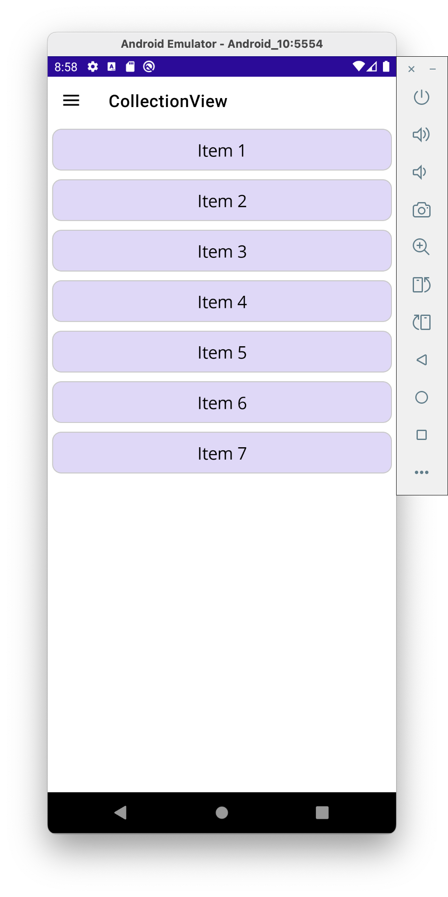

# Cards Project | Proyecto de Tarjetas

## English
This project is a simple demonstration of XAML usage in .NET MAUI (Multi-platform App UI) for educational purposes. It focuses on creating a card-based user interface to help developers understand the fundamentals of XAML layout, styling, and data binding in a cross-platform environment.

This application serves as a learning tool for exploring XAML's capabilities in creating modern and responsive user interfaces. Through this project, you can learn about various XAML controls, layout management, and basic UI/UX principles while building a practical application.

## Español
Este proyecto es una demostración simple del uso de XAML en .NET MAUI (Interfaz de Usuario Multiplataforma) con fines de aprendizaje. Se centra en crear una interfaz de usuario basada en tarjetas para ayudar a los desarrolladores a comprender los fundamentos del diseño XAML, los estilos y el enlace de datos en un entorno multiplataforma.

Esta aplicación sirve como herramienta de aprendizaje para explorar las capacidades de XAML en la creación de interfaces de usuario modernas y responsivas. A través de este proyecto se pueden aprender sobre varios controles XAML, gestión de diseños y principios básicos de UI/UX mientras construyen una aplicación práctica.

## Vista CollectionView

El control CollectionView en .NET MAUI es una vista flexible para presentar listas de datos usando diferentes diseños. Es una alternativa moderna a ListView, ofreciendo mejor rendimiento y más opciones de personalización.

### Características principales de CollectionView

CollectionView permite mostrar datos en diferentes formatos como listas verticales u horizontales, o en diseños de cuadrícula. También soporta selección múltiple y diseños personalizados para cada elemento.

En nuestra aplicación, implementamos CollectionView para mostrar tarjetas de información en un formato atractivo y organizado. Esto demuestra cómo este control puede utilizarse para crear interfaces de usuario dinámicas y responsivas.

A continuación se muestra cómo definimos un CollectionView básico en XAML:

Este código crea una lista vertical de elementos, donde cada elemento se renderiza usando la plantilla definida en ItemTemplate.

Después de aplicar estilos y plantillas a los elementos, podemos transformar una simple lista en un conjunto de tarjetas visualmente atractivas:

El código XAML para implementar esta plantilla personalizada se muestra aquí:

Este fragmento implementa un Frame con esquinas redondeadas, efectos de sombra y un diseño estructurado para cada tarjeta, creando una experiencia visual mejorada.

La capacidad de personalizar cada elemento mediante DataTemplates nos permite crear interfaces consistentes pero visualmente interesantes para nuestros usuarios.
